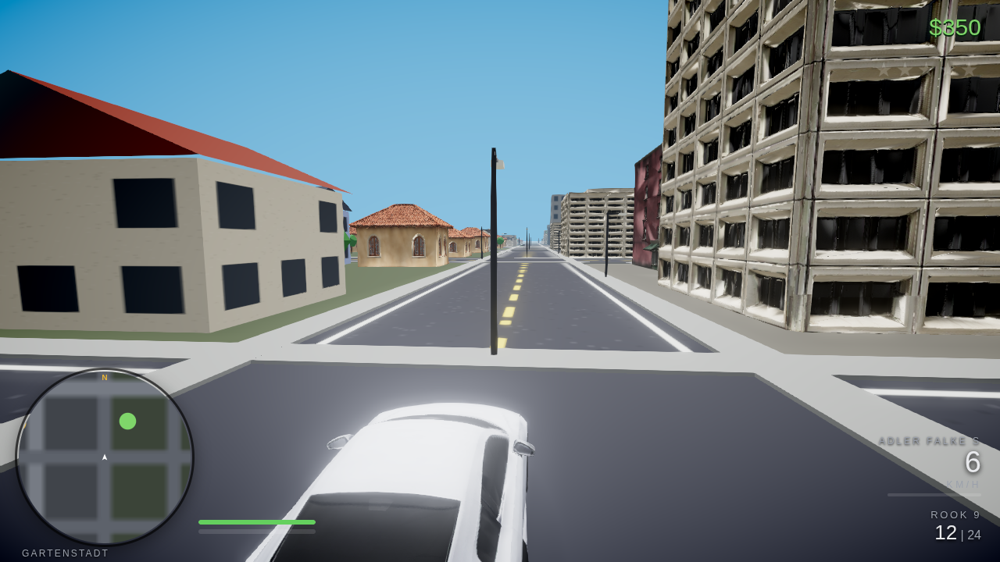
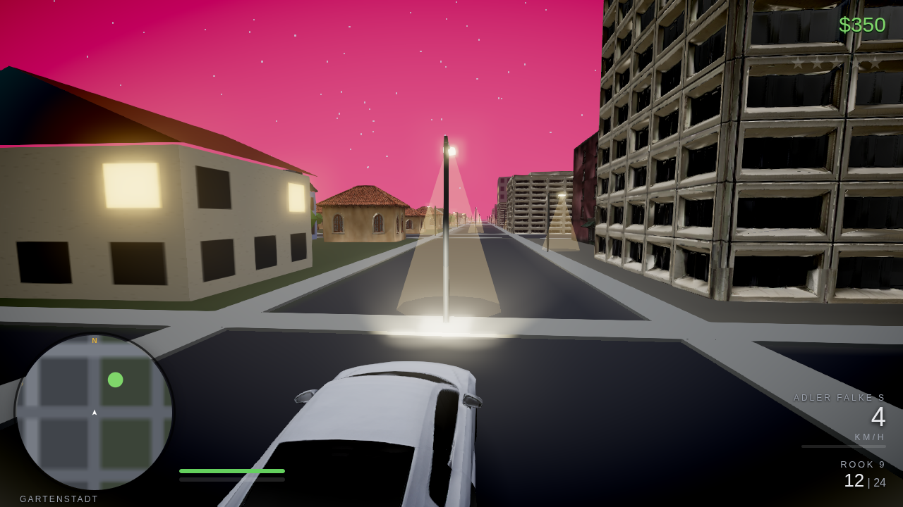
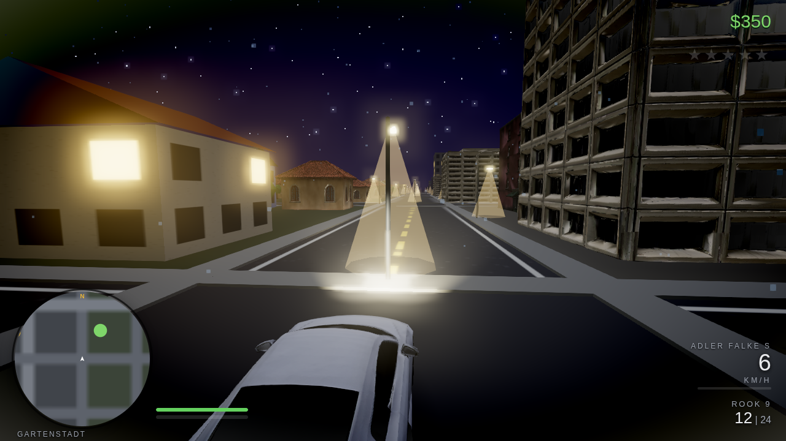
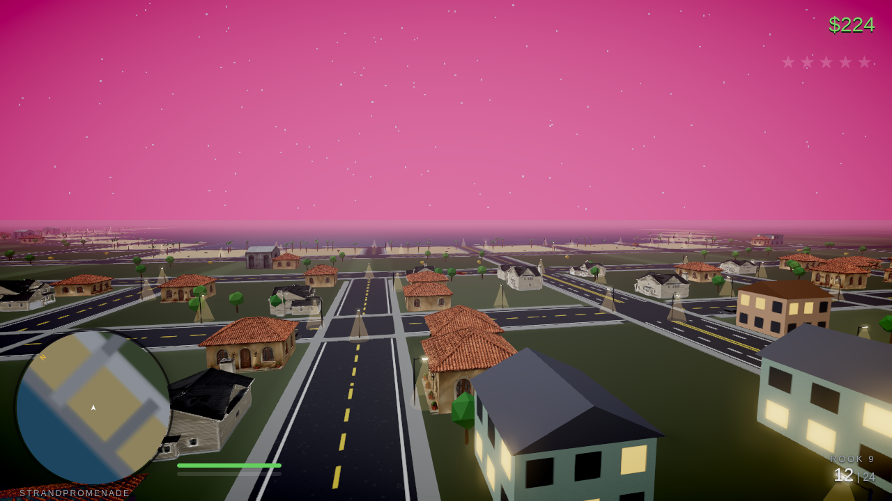
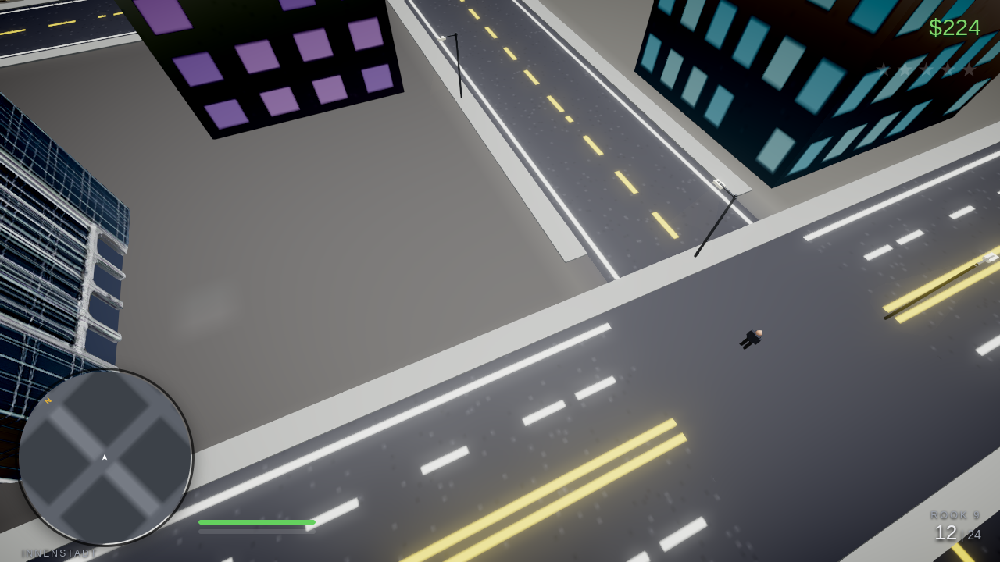

# GRAND THEFT AUDI

An original open-world crime/driving sandbox set in the fictional city of
**Neustadt Bay** — Forza-vibrant looks, arcade-weighty handling, a 1–5★ police
wanted system, robberies, street races and a bank-heist story arc.

Everything is original: the automaker is **Adler Motors**, the police are the
**NBPD**, the radio stations are generative and license-free. No real-world
trademarks, vehicle designs, logos or music.


|  |  |  |
| :--: | :--: | :--: |
| midday, Gartenstadt | Miami dusk | rainy night, wet asphalt |

|  |  |
| :--: | :--: |
| the Strandpromenade over Neustadt Bay | Innenstadt — setback towers & avenues |

*In-engine captures (headless). Cars, buildings and the animated pedestrians
are Higgsfield-generated GLBs — houses, tenements, offices and towers are
instanced from the generated architecture library across the whole 2.9 km map
(see ASSETS.md).*

**Also in this repo:** `unreal/` — a UE **5.7 C++ project starter** (Lumen/Nanite/TSR
configured, city-JSON importer, ChaosVehicles pawn, wanted subsystem) for the
native AAA track. See [unreal/README.md](unreal/README.md).

## What's in the box

| Layer | Tech | What it does |
| --- | --- | --- |
| `client/` | Three.js + cannon-es + Vite | The whole game: chunk-streamed procedural city, raycast-vehicle physics, traffic/pedestrian/police AI, weapons & ragdolls, missions, races, HUD/minimap/GPS, synthesized audio & generative radio |
| `server/` | FastAPI + SQLAlchemy (SQLite) | Save-game persistence, race leaderboards, asset manifest, **the** procedural city generator (exports the JSON the client consumes) |
| `desktop/` | Electron + electron-builder | Windows desktop app (NSIS installer + portable exe) |
| `.github/workflows/` | Actions | `fetch-assets` pulls the Higgsfield-generated GLB hero models into the repo |

## Quick start (dev)

```bash
# 1. backend (optional — the game falls back to localStorage saves)
cd server
python3 -m venv .venv && .venv/bin/pip install -r requirements.txt
.venv/bin/uvicorn main:app --port 8177 &

# 2. client
cd ../client
npm install
npm run dev          # → http://localhost:5173 (Vite proxies /api → :8177)
```

Or use `bash scripts/dev.sh` to launch both.

### Production / single process

```bash
cd client && npm run build          # → client/dist
cd ../server && .venv/bin/uvicorn main:app --port 8177
# → http://localhost:8177 serves the game AND the API
```

### Windows desktop build

```bash
bash scripts/fetch-assets.sh        # optional: pull the GLB hero models
cd desktop && npm install
npm run dist:win                    # → desktop/dist/*.exe (NSIS + portable)
```

Set `GTA_SPAWN_SERVER=1` to have the desktop app boot the Python backend for
server-side saves; without it the game saves to localStorage.

## Controls

`WASD` move/steer · `Shift` sprint/nitro · `Space` jump/handbrake · mouse aim ·
`RMB` aim · `LMB` fire · `R` reload · hold `Tab` weapon wheel · scroll cycle ·
`F` enter/exit/carjack · `E` interact/rob/accept · `H` horn · `N` radio ·
`M` city map (click = GPS waypoint) · `F5` quick save · `Esc` pause

## The city

Neustadt Bay is generated by `server/worldgen/citygen.py` (single source of
truth; the client only consumes its JSON): a downtown tower core, commercial
ring, garden suburbs, harbor docks with cranes and containers, rural outskirts
and a highway ring road. Regenerate with any seed:

```bash
cd server && python3 -m worldgen.citygen --seed 4242 --out ../client/public/world/city.json
```

or hit `/api/world?seed=4242` at runtime (`?seed=` URL param on the client).

## Systems tour

- **Vehicles** — cannon-es raycast vehicles, per-class tuning (super / sedan /
  muscle / offroad / van / armored), grip-vs-drift handbrake model, engine
  damage falloff, tyre blowouts, detachable panels, fire → explosion chains.
- **Wanted system** — crimes add heat when witnessed; 1–5★ escalation: patrol
  cruisers → foot cops → roadblocks + spike strips → SWAT vans → helicopter
  with searchlight and 5★ door-gunner. Losing the heat: line-of-sight decay,
  interiors as hiding spots, pay-off resprays at Spray König.
- **Robbery** — hold up any 24/7 Markt clerk at gunpoint; the till pays out
  over 8 s while the clerk might trip the silent alarm or pull a piece. The
  bank teller pays better. The bank *vault* is a story mission.
- **Missions** — 6-mission arc ending in the multi-stage Meridian Bank job
  (recon → armored-car theft → night vault-crack minigame → 4★ escape).
- **Activities** — 3 street races with rubber-banded AI (leaderboards go to
  the backend), 8 slow-mo stunt jumps, timed delivery gigs, a docks
  steal-to-order list.
- **Audio** — every sound is synthesized in Web Audio (engines, gunfire,
  sirens, rain, thunder); music is a generative sequencer with calm/chase/
  combat moods plus three in-car radio stations.

## Higgsfield-generated hero assets

Hero vehicle models + a rigged pedestrian were generated with Higgsfield AI
(image → `image_to_3d`, textured; ped auto-rigged, a-pose). The game renders
fully procedural models when GLBs are absent — `client/public/models/manifest.json`
controls the swap. Fetch the generated set with `bash scripts/fetch-assets.sh`
or run the **fetch-assets** GitHub Action. Full prompt sheet + regeneration
guide: [ASSETS.md](ASSETS.md).

## Tests

```bash
cd server && .venv/bin/python -m pytest tests/ -q   # API: saves, leaderboard, worldgen
cd client && npm run build && npm run smoke          # boots the real game headless,
                                                     # drives a car, checks zero errors
```

## Roadmap

See [docs/DEVPLAN.md](docs/DEVPLAN.md) for the phase checklist and post-v0 ideas
(skinned ped integration, more interiors, photo mode, gamepad).
